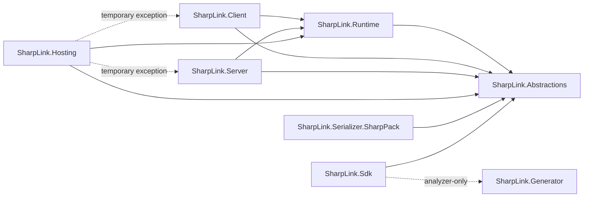

# SharpLink 架构总览

本文档是 SharpLink 架构的导航入口，描述生产子系统的职责、依赖方向和生命周期所有权。项目引用的规范性来源是 [`project-reference-boundaries.yml`](project-reference-boundaries.yml)；人类可读说明见 [`project-reference-boundaries.md`](project-reference-boundaries.md)。如果本页与该边界策略冲突，以边界策略为准。

具体协议字段、调优参数、传输实现细节和兼容性决策分别由专题文档维护，不在这里重复。

## 子系统导航

| 子系统 | 主要所有权 | 详细说明 |
| --- | --- | --- |
| Generator | 契约/服务编译期分析、诊断、生成 Proxy/Stub/Codec/Manifest | [Generator 架构](architecture-generator.md) |
| Runtime | 协议、Session、帧/流调度、发送泵、Codec/Manifest Runtime Context、传输机制 | [Runtime 架构](architecture-runtime.md) |
| Client | Client 配置、连接/端点拓扑、请求状态、重连、取消/deadline 与 `IRpcChannel` | [Client 架构](architecture-client.md) |
| Server | Server 配置、监听/会话编排、服务注册与调用生命周期、认证/异常边界 | [Server 架构](architecture-server.md) |

`SharpLink.Abstractions` 是跨子系统的稳定公共契约层；`SharpLink.Sdk` 是契约项目的包入口并以 analyzer-only 方式携带 Generator；`SharpLink.Hosting` 提供 Generic Host 集成；`SharpLink.Serializer.SharpPack` 提供序列化 Adapter 集成。

## 生产依赖方向

当前生产 `ProjectReference` 方向必须与 #371 建立的边界一致：



关键边界：

- `SharpLink.Abstractions` 不依赖其他 SharpLink 生产项目。
- `SharpLink.Runtime` 只向下依赖 `SharpLink.Abstractions`，不能依赖 Client、Server 或 Hosting。
- Client 与 Server 是同级边界，彼此不能直接引用；二者只共享 Runtime 机制和 Abstractions 契约。
- `SharpLink.Generator` 没有生产程序集引用；`SharpLink.Sdk -> SharpLink.Generator` 只能是 analyzer-only 引用，不能变成运行时程序集依赖。
- Hosting 到 Client/Server 的两个现有引用是显式临时例外，不应被解释为可扩张的架构先例。
- 任何新增生产项目或引用边都必须同时更新规范边界；不能用“传递依赖已经存在”作为新增直接引用的理由。

完整允许/禁止边、模式语义和临时例外见 [`project-reference-boundaries.md`](project-reference-boundaries.md)。

## 编译期到运行时的数据流

```text
Contract / Service source
        |
        v
SharpLink.Sdk + Generator (compile time)
        |
        +--> generated descriptors / proxy / stub / codec / manifest
        |
        v
Generated assembly + SharpLink.Abstractions
        |
        +--> Client owns outbound call policy and request lifecycle
        |        |
        |        v
        |    Runtime owns framing / transport / session mechanics
        |        |
        |        v
        +--> Server owns service dispatch policy and invocation lifecycle
```

Generator 负责把可在编译期确定的契约信息固化为生成 Artifact；运行时不应重新扫描源码级契约来恢复这些信息。Client/Server 负责业务侧生命周期和策略，Runtime 负责共享协议与传输机制。

## 生命周期所有权

### Generator

Generator 生命周期只存在于编译阶段。它读取 Roslyn 符号与 metadata，产生确定性的生成源码和诊断；运行时不持有 Generator 实例或 Generator 状态。详见 [Generator 架构](architecture-generator.md)。

### Runtime

Runtime 拥有 Runtime Context 与单条物理 Session 的机制状态，包括帧读写、发送泵、stream dispatcher、flow-control、传输连接和 Runtime 级 Codec/Manifest 状态。Context 构建后配置冻结；Session 终止必须释放其所有底层资源。详见 [Runtime 架构](architecture-runtime.md)。

### Client

Client 拥有从 Build 到 Connect/Stop 的客户端实例生命周期，以及 endpoint snapshot、连接池、重连 worker、pending request、request-to-session 绑定和调用取消/deadline 状态。Runtime Session 是 Client 使用的机制，不反向拥有 Client 策略。详见 [Client 架构](architecture-client.md)。

### Server

Server 拥有从 Build 到 Run/Stop 的服务端实例生命周期，以及 listener、连接接入、服务 Registry、认证上下文、调用/stream 生命周期与排空。Runtime 负责帧和 Session 机制；生成 Stub/Activator 负责类型安全的调用入口。详见 [Server 架构](architecture-server.md)。

## 性能与 NativeAOT 原则

四个子系统共同遵循以下架构原则：

- 能在编译期确定的契约、调用和序列化绑定优先由 Generator 固化，避免运行时反射扫描、动态类型构造或按调用发现元数据。
- Runtime 的稳态路径使用冻结配置、池化资源和有界状态；可选能力关闭时不应迫使基础调用路径承担对应的对象图、锁或后台 worker。
- Client/Server 的策略层不应把业务选择下沉成 Runtime 全局可变状态；每个实例/Context 的配置和所有权必须明确。
- Generator 是 build-time 工具而不是运行时依赖；analyzer-only 边界必须保持，以避免把 Roslyn/Generator 依赖带入发布或 NativeAOT 闭包。
- 生成 Proxy/Stub/Codec/Activator 应提供 NativeAOT 友好的静态路径；需要动态模块能力时，动态加载生命周期必须与静态/AOT 快路径隔离。

更具体的性能、NativeAOT 与平台约束见 [`limits-and-tuning.md`](limits-and-tuning.md)、[`transports.md`](transports.md) 和 [`dynamic-modules-and-multicluster.md`](dynamic-modules-and-multicluster.md)。

## 跨子系统调用链

以 Unary 为例：

1. Generator 生成的 Proxy 通过 Abstractions 定义的调用契约进入 Client。
2. Client 解析实例配置、endpoint/connection 选择、deadline/取消并建立 pending call。
3. Runtime 把调用编码为协议帧，通过选定 transport/session 发送和接收。
4. Server 根据生成 Descriptor/Stub 与服务 Registry 建立调用上下文并执行服务。
5. Runtime 负责响应帧和 stream terminal 的传输机制；Server 负责异常映射等服务端策略。
6. Client 完成对应 pending call，并以调用侧语义暴露结果、取消、deadline 或远端错误。

Streaming 沿用相同边界：Runtime 拥有 frame/stream/flow-control 机制，Client/Server 分别拥有调用侧和服务侧生命周期策略。调用语义详见 [`calls-and-streaming.md`](calls-and-streaming.md)，线协议详见 [`protocol-v2.md`](protocol-v2.md)。

## 专题文档边界

以下内容不在架构总览或四个子系统页复制：

- 线协议和 capability：[`protocol-v2.md`](protocol-v2.md)
- Codec、Manifest 与 Adapter SPI：[`contracts-and-codecs.md`](contracts-and-codecs.md)
- 动态注册、替换、卸载和多集群：[`dynamic-modules-and-multicluster.md`](dynamic-modules-and-multicluster.md)
- Client endpoint、Retry、Circuit Breaker：[`resilience.md`](resilience.md)
- 传输/TLS/SharedMemory：[`transports.md`](transports.md)
- Server 接入控制：[`admission-control.md`](admission-control.md)
- Generic Host 与服务生命周期：[`hosting-and-services.md`](hosting-and-services.md)
- 认证授权与安全边界：[`security.md`](security.md)
- Interceptor、Activity、Meter 和日志：[`observability.md`](observability.md)

当某个决定需要独立的取舍背景、替代方案或迁移策略时，应放入相应设计/ADR 类文档，而不是把决策历史复制进本页。
