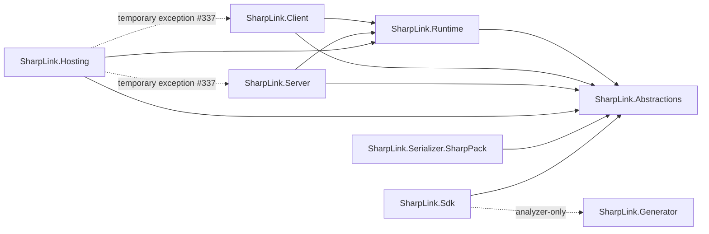

# Project-reference boundaries

This note defines SharpLink's production `ProjectReference` architecture. The machine-readable source of truth is [`project-reference-boundaries.yml`](project-reference-boundaries.yml). If this note and the YAML disagree, the YAML wins.

The policy is intentionally closed-world and default-deny: every production project is named explicitly, every permitted edge is listed explicitly, and every other production `ProjectReference` is forbidden unless it is listed as a temporary exception.

## Scope

The policy applies to `ProjectReference` edges originating from the canonical projects under `src/`:

- `SharpLink.Abstractions`
- `SharpLink.Runtime`
- `SharpLink.Client`
- `SharpLink.Server`
- `SharpLink.Hosting`
- `SharpLink.Sdk`
- `SharpLink.Generator`
- `SharpLink.Serializer.SharpPack`

It does not define `PackageReference` semantics, package dependency closure, test-project topology, or sample/demo topology. Production projects must not reference projects under `test/`, `samples/`, or other non-canonical project roots.

## Canonical graph

An arrow means "the project on the left may reference the project on the right".

`SharpLink.Abstractions` and `SharpLink.Generator` have no permitted production assembly references. The `Sdk -> Generator` edge is not a runtime/assembly dependency: it must remain an analyzer-only `ProjectReference` with the metadata specified below.

## Exact allowed edges

| From | To | Mode | Conditions |
| --- | --- | --- | --- |
| `SharpLink.Runtime` | `SharpLink.Abstractions` | assembly | none |
| `SharpLink.Client` | `SharpLink.Runtime` | assembly | none |
| `SharpLink.Client` | `SharpLink.Abstractions` | assembly | none |
| `SharpLink.Server` | `SharpLink.Runtime` | assembly | none |
| `SharpLink.Server` | `SharpLink.Abstractions` | assembly | none |
| `SharpLink.Hosting` | `SharpLink.Runtime` | assembly | none |
| `SharpLink.Hosting` | `SharpLink.Abstractions` | assembly | none |
| `SharpLink.Serializer.SharpPack` | `SharpLink.Abstractions` | assembly | none |
| `SharpLink.Sdk` | `SharpLink.Abstractions` | assembly | none |
| `SharpLink.Sdk` | `SharpLink.Generator` | analyzer | `OutputItemType="Analyzer"`, `ReferenceOutputAssembly="false"` |

The table is explanatory. The YAML is normative and is the input a future guard should consume.

For an analyzer edge, `required_metadata` defines required key/value invariants, not the complete metadata set. The current `dev` reference also has `Condition` and `GlobalPropertiesToRemove`; those are build/publishing details and are intentionally not frozen by this project-reference boundary. A future guard must require the listed metadata values while permitting additional metadata unless the policy explicitly models it.

## Forbidden directions

Because the policy is default-deny, an edge does not need a separate blacklist entry to be forbidden. In particular, the following are forbidden unless the YAML is deliberately changed:

- `Client -> Server` and `Server -> Client`.
- `Client -> Hosting`, `Server -> Hosting`, `Runtime -> Client/Server/Hosting`, or `Abstractions ->` any other SharpLink production project.
- `Serializer.* -> Runtime/Client/Server/Hosting/Sdk/Generator`.
- production assembly references from or into `SharpLink.Generator`; the only permitted generator edge is `Sdk -> Generator` in analyzer-only mode.
- production references to projects under `test/`, `samples/`, demo roots, or any project not named in the policy.
- any newly-added production `ProjectReference` that is not an exact match for an `allowed_references` entry or an explicit `temporary_exceptions` entry.

Direct references that skip a layer are not automatically forbidden. For example, `Client -> Abstractions` and `Server -> Abstractions` are intentional and therefore listed explicitly. Mechanical enforcement must compare exact edges, not infer a generic layering rule.

## Temporary exceptions and technical debt

| From | To | Status | Provenance | Constraint |
| --- | --- | --- | --- | --- |
| `SharpLink.Hosting` | `SharpLink.Client` | temporary exception | #337 | Existing edge may remain; the exception does not authorize additional Hosting-to-Client coupling. |
| `SharpLink.Hosting` | `SharpLink.Server` | temporary exception | #337 | Existing edge may remain; the exception does not authorize additional Hosting-to-Server coupling. |

These two edges are present on `dev` today and are kept visible rather than silently treating them as architectural precedent. Issue #337 documents the coupling concern. Although #337 is closed, the project references still exist, so this policy records them as current debt until a separate refactor removes them or an explicit architecture decision promotes them to normal allowed edges.

Removing an exception requires both removing the corresponding `ProjectReference` from the project file and deleting the exception from the YAML. Adding an exception requires an explicit policy change with a reason and provenance issue.

## Current `dev` inventory

The policy was checked against the production project files on `dev` while defining this boundary:

| Project | Current production `ProjectReference` targets |
| --- | --- |
| `SharpLink.Abstractions` | none |
| `SharpLink.Runtime` | `SharpLink.Abstractions` |
| `SharpLink.Client` | `SharpLink.Runtime`, `SharpLink.Abstractions` |
| `SharpLink.Server` | `SharpLink.Runtime`, `SharpLink.Abstractions` |
| `SharpLink.Hosting` | `SharpLink.Client`, `SharpLink.Server`, `SharpLink.Runtime`, `SharpLink.Abstractions` |
| `SharpLink.Generator` | none |
| `SharpLink.Sdk` | `SharpLink.Abstractions`, `SharpLink.Generator` (analyzer-only) |
| `SharpLink.Serializer.SharpPack` | `SharpLink.Abstractions` |

Every current production edge is therefore either an allowed edge or one of the two explicit Hosting exceptions.

## Mechanical interpretation

A future guard can enforce this file without inferring architectural intent:

1. Load `project-reference-boundaries.yml`.
2. Treat the `projects` mapping as the complete canonical production-project set.
3. Parse every canonical `.csproj` and enumerate its `ProjectReference` items.
4. Resolve each target path to a canonical project id. Reject a reference whose target is outside the canonical mapping.
5. Match each edge against `allowed_references` or `temporary_exceptions`.
6. For `mode: analyzer`, require every `required_metadata` key/value to match exactly. Additional metadata is allowed unless the policy explicitly constrains it; a missing or mismatched required key makes the reference forbidden.
7. Reject every unlisted edge because `scope.default` is `deny`.
8. Do not inspect or infer rules from `PackageReference`; package dependency enforcement is a separate concern.

A checker may additionally report stale policy entries (an allowed edge or exception that no longer exists), but stale-entry handling is a guard implementation choice rather than part of this issue.

## Tests and validation evidence

There is currently no test that mechanically enforces this exact production `ProjectReference` graph. Existing package-smoke, generator, compatibility, and runtime tests validate related packaging or behavior, but they are not architecture guards and should not be cited as substitutes for this policy.

For this change, validation is design/document review plus a comparison of the policy against the current `dev` production `.csproj` files. Implementing the automated guard is intentionally out of scope for #371.

## Changing the boundary

A production reference change is an architecture change. A PR that adds, removes, or changes a production `ProjectReference` should update the YAML in the same change when the intended policy changes. New edges must not be justified by the fact that a transitive dependency already exists; the policy records direct project references only.
