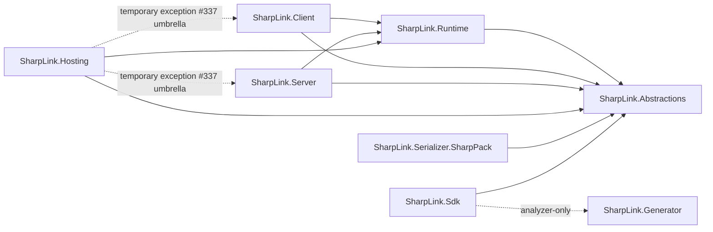

# Project-reference boundaries

This note defines SharpLink's production `ProjectReference` architecture. The machine-readable source of truth is [`project-reference-boundaries.yml`](project-reference-boundaries.yml). If this note and the YAML disagree, the YAML wins.

The policy is intentionally closed-world and default-deny: every production project is named explicitly, every permitted edge is listed explicitly, and every other production `ProjectReference` is forbidden unless it is listed as a temporary exception.

## Scope

The policy applies to production projects discovered under `src/`. The current registered set is:

- `SharpLink.Abstractions`
- `SharpLink.Runtime`
- `SharpLink.Client`
- `SharpLink.Server`
- `SharpLink.Hosting`
- `SharpLink.Sdk`
- `SharpLink.Generator`
- `SharpLink.Serializer.SharpPack`

The registered set is exact, not merely a list of projects that happen to be checked. A future guard must enumerate every `.csproj` matching `scope.production_project_glob` under `scope.production_root`, normalize the repository-relative paths, and require that discovered set to equal the paths in `projects`. An unregistered production project is therefore a policy violation even before its references are evaluated.

This policy does not define `PackageReference` semantics, package dependency closure, test-project topology, or sample/demo topology. Test-originating `ProjectReference` policy was deliberately split from #371 and is tracked in #431. Production projects must not reference projects under `test/`, `samples/`, or other non-canonical project roots.

## Canonical graph

An arrow means "the project on the left may reference the project on the right".

`SharpLink.Abstractions` and `SharpLink.Generator` have no permitted production assembly references. The `Sdk -> Generator` edge is not a runtime/assembly dependency: it must remain an analyzer-only `ProjectReference` with the mode semantics specified below.

## Reference mode semantics

`mode` is part of the architecture policy, not descriptive metadata. A guard must classify each evaluated `ProjectReference` from its effective MSBuild metadata and require that classification to match the mode on the policy edge.

### `mode: assembly`

An assembly reference must satisfy all of the following:

- effective `ReferenceOutputAssembly` is `true`;
- an omitted `ReferenceOutputAssembly` is interpreted as the MSBuild default `true`;
- `OutputItemType` must not be `Analyzer`.

Therefore changing an otherwise allowed edge such as `Client -> Runtime` to `ReferenceOutputAssembly="false"`, or turning it into an analyzer-style reference, is a policy violation even though the `from` and `to` projects are unchanged.

### `mode: analyzer`

An analyzer-only reference must satisfy all of the following effective metadata invariants:

- `OutputItemType="Analyzer"`;
- `ReferenceOutputAssembly="false"`.

Additional metadata is allowed unless the YAML explicitly constrains it. For example, the current `Sdk -> Generator` reference also has `Condition` and `GlobalPropertiesToRemove`; those are build/publishing details and are intentionally not frozen by this boundary.

For the boolean `ReferenceOutputAssembly` metadata, the guard must normalize MSBuild boolean values before comparison; a missing value uses the documented `true` default. For the `Analyzer` item-type token, the guard should compare after normalizing case so an equivalent casing cannot bypass the mode check. Missing, malformed, or conflicting metadata that prevents the required mode from being established must fail closed.

## ProjectReference discovery semantics

A `.csproj` is not the complete MSBuild project. `Directory.Build.props`, `Directory.Build.targets`, SDK imports, and explicit imports can contribute evaluated items. The guard must therefore use MSBuild project evaluation, or an equivalent mechanism that returns the evaluated `ProjectReference` item set, rather than enumerating only raw `<ProjectReference>` XML nodes in the `.csproj` file.

The evaluated set must include statically declared `ProjectReference` items contributed by imports and must respect MSBuild conditions in the guard's defined evaluation context. A forbidden reference introduced through an imported `.props` or `.targets` file is the same architecture violation as one written directly in the `.csproj`.

## Exact allowed edges

| From | To | Mode | Conditions |
| --- | --- | --- | --- |
| `SharpLink.Runtime` | `SharpLink.Abstractions` | assembly | assembly mode semantics |
| `SharpLink.Client` | `SharpLink.Runtime` | assembly | assembly mode semantics |
| `SharpLink.Client` | `SharpLink.Abstractions` | assembly | assembly mode semantics |
| `SharpLink.Server` | `SharpLink.Runtime` | assembly | assembly mode semantics |
| `SharpLink.Server` | `SharpLink.Abstractions` | assembly | assembly mode semantics |
| `SharpLink.Hosting` | `SharpLink.Runtime` | assembly | assembly mode semantics |
| `SharpLink.Hosting` | `SharpLink.Abstractions` | assembly | assembly mode semantics |
| `SharpLink.Serializer.SharpPack` | `SharpLink.Abstractions` | assembly | assembly mode semantics |
| `SharpLink.Sdk` | `SharpLink.Abstractions` | assembly | assembly mode semantics |
| `SharpLink.Sdk` | `SharpLink.Generator` | analyzer | `OutputItemType="Analyzer"`, `ReferenceOutputAssembly="false"` |

The table is explanatory. The YAML is normative and is the input a future guard should consume.

## Forbidden directions

Because the policy is default-deny, an edge does not need a separate blacklist entry to be forbidden. In particular, the following are forbidden unless the YAML is deliberately changed:

- `Client -> Server` and `Server -> Client`.
- `Client -> Hosting`, `Server -> Hosting`, `Runtime -> Client/Server/Hosting`, or `Abstractions ->` any other SharpLink production project.
- `Serializer.* -> Runtime/Client/Server/Hosting/Sdk/Generator`.
- production assembly references from or into `SharpLink.Generator`; the only permitted generator edge is `Sdk -> Generator` in analyzer-only mode.
- production references to projects under `test/`, `samples/`, demo roots, or any project not named in the policy.
- any newly-added production `ProjectReference` that is not an exact match for an `allowed_references` entry or an explicit `temporary_exceptions` entry.
- any allowed `from`/`to` pair whose evaluated MSBuild metadata does not satisfy the edge's declared `mode`.
- any forbidden edge introduced through an imported `.props`, `.targets`, SDK import, or other evaluated MSBuild input.
- any newly-added `.csproj` under the production root that is not registered in `projects`.

Direct references that skip a layer are not automatically forbidden. For example, `Client -> Abstractions` and `Server -> Abstractions` are intentional and therefore listed explicitly. Mechanical enforcement must compare exact edges and modes, not infer a generic layering rule.

## Temporary exceptions and technical debt

| From | To | Status | Tracking provenance | Constraint |
| --- | --- | --- | --- | --- |
| `SharpLink.Hosting` | `SharpLink.Client` | temporary exception | #337 (umbrella roadmap) | Existing edge may remain in assembly mode; the exception does not authorize additional Hosting-to-Client coupling. |
| `SharpLink.Hosting` | `SharpLink.Server` | temporary exception | #337 (umbrella roadmap) | Existing edge may remain in assembly mode; the exception does not authorize additional Hosting-to-Server coupling. |

These two edges are present on `dev` today and are kept visible rather than silently treating them as architectural precedent. #337 is the open umbrella/root maintainability roadmap and is used here only as tracking provenance for this existing debt; it does not document a specific architectural decision about these two exact edges. The exceptions remain debt until a focused refactor removes them or an explicit architecture decision promotes them to normal allowed edges.

Removing an exception requires both removing the corresponding `ProjectReference` from the project file and deleting the exception from the YAML. Adding an exception requires an explicit policy change with a reason and tracking provenance.

## Current `dev` inventory

The policy was checked against the production project files on `dev` while defining this boundary:

| Project | Current production `ProjectReference` targets |
| --- | --- |
| `SharpLink.Abstractions` | none |
| `SharpLink.Runtime` | `SharpLink.Abstractions` |
| `SharpLink.Client` | `SharpLink.Runtime`, `SharpLink.Abstractions` |
| `SharpLink.Server` | `SharpLink.Runtime`, `SharpLink.Abstractions` |
| `SharpLink.Hosting` | `SharpLink.Client`, `SharpLink.Server`, `SharpLink.Runtime`, `SharpLink.Abstractions` |
| `SharpLink.Generator` | none |
| `SharpLink.Sdk` | `SharpLink.Abstractions`, `SharpLink.Generator` (analyzer-only) |
| `SharpLink.Serializer.SharpPack` | `SharpLink.Abstractions` |

Every current production edge is therefore either an allowed edge or one of the two explicit Hosting exceptions. The current set of production `.csproj` files under `src/` also matches the eight paths registered in the YAML. The repository currently has no imported production `ProjectReference` that changes this inventory, but imports remain in scope for future enforcement.

## Mechanical interpretation

A future guard can enforce this file without inferring architectural intent:

1. Load `project-reference-boundaries.yml`.
2. Enumerate every `.csproj` matching `scope.production_project_glob` under `scope.production_root`.
3. Normalize the discovered repository-relative paths and the paths in `projects`, then require the two sets to be exactly equal. Fail on either an unregistered discovered project or a registered path that does not exist.
4. Evaluate every discovered/registered production project with MSBuild semantics. Raw parsing of only the `.csproj` XML is not sufficient.
5. Enumerate the evaluated `ProjectReference` items, including items contributed by `Directory.Build.props`, `Directory.Build.targets`, SDK imports, and explicit imports, with conditions resolved in the guard's defined evaluation context.
6. Resolve each evaluated target path to a canonical project id. Reject a reference whose target is outside the canonical mapping.
7. Match each edge against `allowed_references` or `temporary_exceptions`.
8. Classify each matched reference using `mode_semantics` from the YAML and require the actual mode to equal the policy edge's `mode`:
   - for `assembly`, effective `ReferenceOutputAssembly` must be `true` (using the MSBuild default when omitted) and `OutputItemType` must not be `Analyzer`;
   - for `analyzer`, effective `OutputItemType` must be `Analyzer` and effective `ReferenceOutputAssembly` must be `false`.
9. Reject every unlisted edge or mode mismatch because `scope.default` is `deny`.
10. Do not inspect or infer rules from `PackageReference`; package dependency enforcement is a separate concern.

`mechanical_rules.canonical_projects_are_exact`, `discovered_production_projects_must_equal_registered_projects`, and `evaluated_project_references_include_imports` therefore close the policy over the production root and evaluated project graph, not merely over known `.csproj` XML nodes.

A checker may additionally report stale allowed-edge or exception entries that no longer exist. Missing registered project paths are not optional stale-policy warnings: they violate the exact project-set rule above.

## Tests and validation evidence

There is currently no test that mechanically enforces this exact production `ProjectReference` graph. Existing package-smoke, generator, compatibility, and runtime tests validate related packaging or behavior, but they are not architecture guards and should not be cited as substitutes for this policy.

For this change, validation is design/document review plus a comparison of the policy against the current `dev` production project graph. Implementing the automated production guard is intentionally out of scope for #371 and tracked by #372. #372 must include negative fixtures for assembly-mode drift and imported forbidden references so these semantics remain executable rather than advisory. Test-project topology is tracked separately by #431.

## Changing the boundary

A production project or reference change is an architecture change. A PR that adds or removes a production `.csproj`, or adds, removes, or changes a production `ProjectReference`, must update the YAML in the same change when the intended policy changes. New projects cannot be omitted from the registry, and new edges must not be justified by the fact that a transitive dependency already exists; the policy records direct evaluated project references only.
